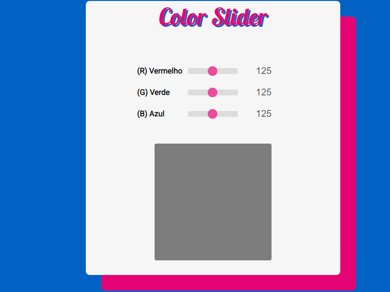

# Color Slider (Vanilla Js)

Hello,

Welcome to the color slider, you can slide through colors and get the correct number for your RGB composition with a beautiful preview.

You may be asking, "Wonderful, how can I do this"?

Just open the index.html file in <strike>whatever browser</strike> Chrome and you can see the magic, as the GIF below!

PS.: Project created for studying purposes, IGTI Fullstack Bootcamp.

## Page Screen

 
 

